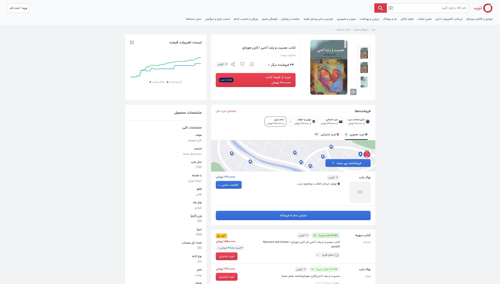
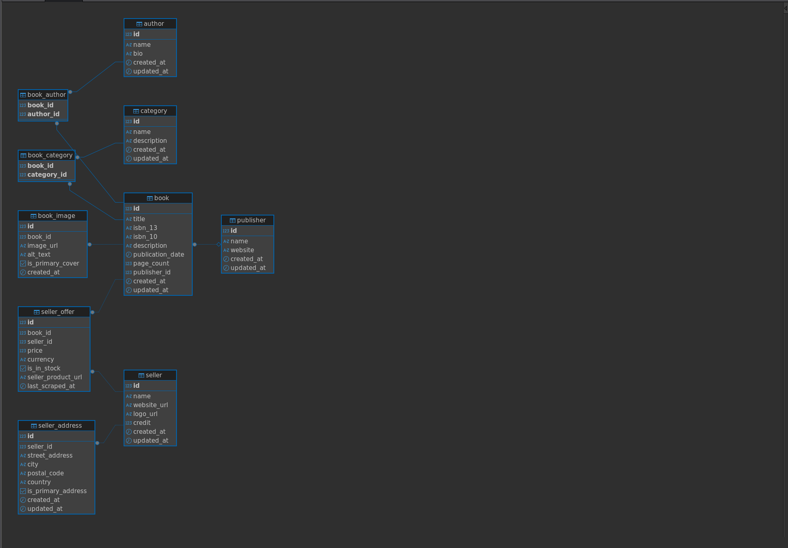
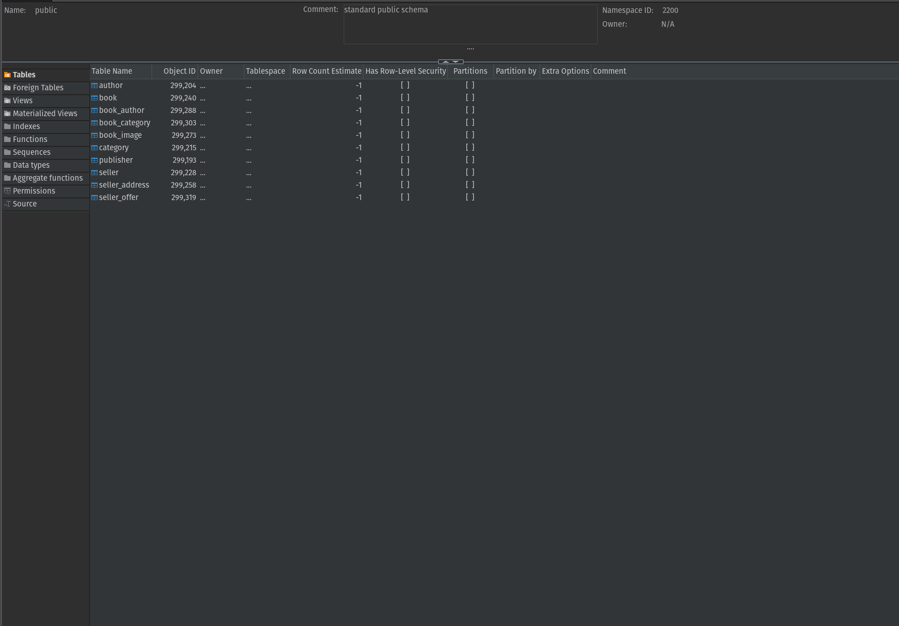

# PostgreSQL Schema for a Book section in Torob.com

## Project Overview

This repository contains the complete database schema for the book section of a price comparison aggregator website, modeled after services like Torob.com. The schema is designed to efficiently store and manage data about books, publishers, authors, sellers, and their respective price offerings.

The primary goal of this project was to design and implement a robust, highly-normalized, and scalable database architecture using PostgreSQL. The design emphasizes data integrity, query performance, and adherence to established database design principles.

***

## Schema Design Philosophy

The architecture is built upon the following core principles:

* **Third Normal Form (3NF):** The schema is fully normalized to at least 3NF. This was achieved by separating distinct entities into their own tables and using junction tables to resolve many-to-many relationships. This approach minimizes data redundancy, prevents data anomalies (insertion, update, deletion), and ensures a single source of truth for all entities.
* **Data Integrity:** Relationships between tables are strictly enforced using Primary and Foreign Key constraints. This guarantees referential integrity, preventing orphaned records and ensuring that data remains consistent across the database.
* **Performance and Scalability:** A comprehensive indexing strategy is implemented to ensure fast query performance for common use cases, such as searching for books, joining tables to retrieve offers, and sorting by price. Appropriate data types were chosen to optimize storage and speed.

***

## Entity-Relationship Diagram (ERD)

The following diagram illustrates the relationships between the tables in the schema.

```mermaid
erDiagram
    publisher {
        bigserial id PK
        varchar name
        varchar website
        timestamptz created_at
        timestamptz updated_at
    }
    author {
        bigserial id PK
        varchar name
        text bio
        timestamptz created_at
        timestamptz updated_at
    }
    category {
        bigserial id PK
        varchar name
        text description
        timestamptz created_at
        timestamptz updated_at
    }
    seller {
        bigserial id PK
        varchar name
        varchar website_url
        varchar logo_url
        integer credit
        timestamptz created_at
        timestamptz updated_at
    }
    book {
        bigserial id PK
        varchar title
        varchar isbn_13
        varchar isbn_10
        text description
        date publication_date
        integer page_count
        bigint publisher_id FK
        timestamptz created_at
        timestamptz updated_at
    }
    seller_address {
        bigserial id PK
        bigint seller_id FK
        varchar street_address
        varchar city
        varchar postal_code
        varchar country
        boolean is_primary_address
        timestamptz created_at
        timestamptz updated_at
    }
    book_image {
        bigserial id PK
        bigint book_id FK
        varchar image_url
        varchar alt_text
        boolean is_primary_cover
        timestamptz created_at
    }
    seller_offer {
        bigserial id PK
        bigint book_id FK
        bigint seller_id FK
        numeric price
        varchar currency
        boolean is_in_stock
        varchar seller_product_url
        timestamptz last_scraped_at
    }
    book_author {
        bigint book_id PK, FK
        bigint author_id PK, FK
    }
    book_category {
        bigint book_id PK, FK
        bigint category_id PK, FK
    }

    publisher ||--o{ book : "publishes"
    book }o--o{ book_author : "written by"
    author ||--o{ book_author : "writes"
    book }o--o{ book_category : "belongs to"
    category ||--o{ book_category : "contains"
    book }o--o{ book_image : "has"
    book }o--o{ seller_offer : "is offered in"
    seller ||--o{ seller_offer : "makes"
    seller ||--o{ seller_address : "has"
````

-----

## Torob



### Digram



### Tabales



-----

## Schema Breakdown

### Core Entity Tables

  * **`publisher`**: Stores publisher information.
  * **`author`**: Stores author names and biographies.
  * **`category`**: A master list of predefined book genres to ensure consistency.
  * **`seller`**: Contains details about the e-commerce stores offering books.
  * **`book`**: The central table holding unique book information, including title and ISBN.

### Relational & Attribute Tables

  * **`seller_address`**: A seller can have multiple addresses.
  * **`book_image`**: A book can have multiple images (e.g., front cover, back cover).
  * **`seller_offer`**: The core transactional table. It links a specific `book` to a specific `seller`, storing the `price`, stock status, and the direct URL to the product on the seller's site. This is the heart of the price comparison functionality.

### Junction Tables (for Many-to-Many Relationships)

  * **`book_author`**: Links books to their authors, correctly modeling that a book can have multiple authors and an author can write multiple books.
  * **`book_category`**: Links books to one or more categories.

-----

## Key Technical Decisions

  * **`BIGSERIAL` for Primary Keys**: Provides auto-incrementing, unique identifiers for all main entities, simplifying data insertion and management.
  * **`TIMESTAMPTZ` for Timestamps**: All `created_at` and `updated_at` columns use the `TIMESTAMP WITH TIME ZONE` type. This is crucial for applications that may operate across different time zones, ensuring all timestamps are unambiguous.
  * **Triggers for `updated_at`**: A reusable function (`trigger_set_timestamp`) and associated triggers automatically update the `updated_at` column on any row modification, reducing application-level logic.
  * **Strategic Indexing**:
      * **Foreign Keys**: All foreign key columns are indexed to optimize `JOIN` performance.
      * **Search/Sort Columns**: Indexes are created on columns frequently used in `WHERE` clauses (`book.title`, `seller.name`) and `ORDER BY` clauses (`seller_offer.price`) to ensure the application remains fast and responsive.
  * **`ON DELETE` Policies**:
      * `CASCADE`: Used where child data is entirely dependent on the parent (e.g., deleting a `seller` also deletes their `seller_address` and `seller_offer` records).
      * `SET NULL`: Used where the child entity can logically exist without the parent (e.g., deleting a `publisher` sets `book.publisher_id` to `NULL`, but the book record itself is preserved).


<!-- end list -->

```
